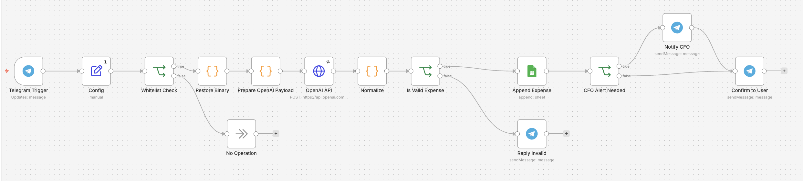
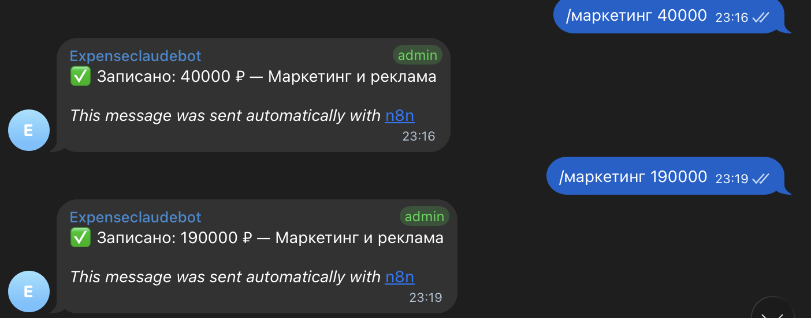
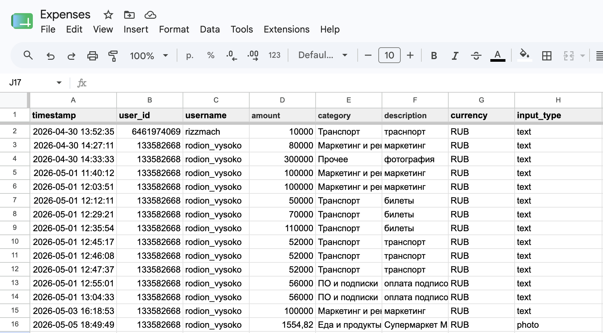

# AI Expense Tracking Bot

> A Telegram bot that logs team expenses to Google Sheets from a text
> message or a photo of a receipt — with automatic categorization and
> instant alerts to leadership on large spends.

## Problem
Small teams struggle to keep expense records current. Manual entry into
a spreadsheet is tedious and easily skipped, receipts get lost, and by
month-end the data is incomplete and inconsistently categorized. Owners
also have no real-time visibility when someone makes a large purchase.

## Solution
A Telegram bot that turns expense logging into a one-line message. A team
member sends the expense as text (e.g. "marketing 40000") or as a photo
of a receipt. The workflow uses OpenAI (GPT-4o-mini with vision) to read
the amount and assign a category, writes a structured row to Google
Sheets, and confirms back in the chat. If a spend exceeds a set
threshold, it instantly notifies the CFO in a private message.

## Key features
- **Text and photo input** — type the expense or snap the receipt;
  vision handles the image
- **Automatic categorization** into a predefined set of expense categories
- **Access control** — only whitelisted team members are processed;
  everyone else is silently ignored
- **Large-spend alerts** — expenses above a configurable threshold
  trigger an instant private alert to leadership
- **Validation** — if the amount can't be confidently read, the bot asks
  the user to resend instead of writing bad data

## How it works
- A Telegram message (text or photo) triggers the workflow
- The sender is checked against a whitelist
- The message or image is sent to OpenAI, which returns structured data
  (amount, category, description, currency, confidence)
- The data is validated, then appended as a new row in Google Sheets
- If the amount is above the threshold, the CFO gets a private alert
- The user receives a confirmation in the chat

## Stack
- n8n (self-hosted, Docker)
- Telegram Bot API
- OpenAI (GPT-4o-mini, vision-enabled)
- Google Sheets API

## Outcome
Expenses are captured in seconds instead of minutes, consistently
categorized, and never lost between purchase and bookkeeping. Leadership
gets real-time visibility into significant spending without ever opening
the spreadsheet.

## Screenshots

*The full workflow: Telegram trigger, access check, AI extraction,
Google Sheets write, and conditional alerting.*

*Logging an expense from a chat message and getting an instant confirmation.*

*Each expense lands as a structured row, ready for reporting.*
