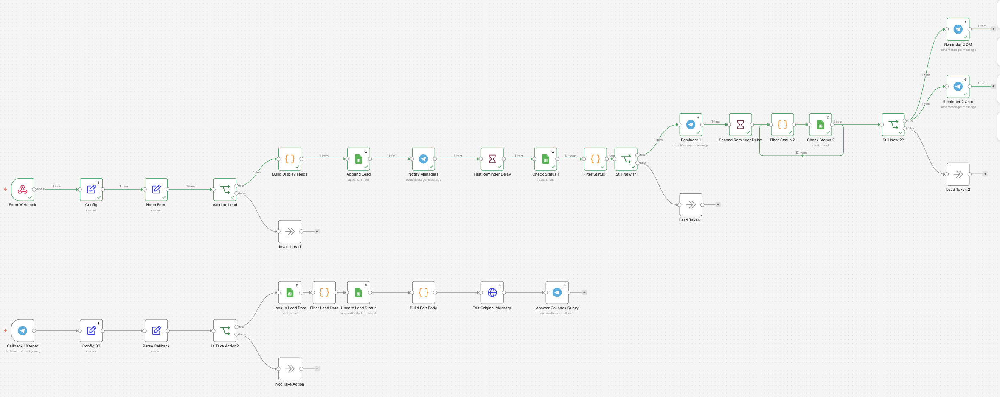
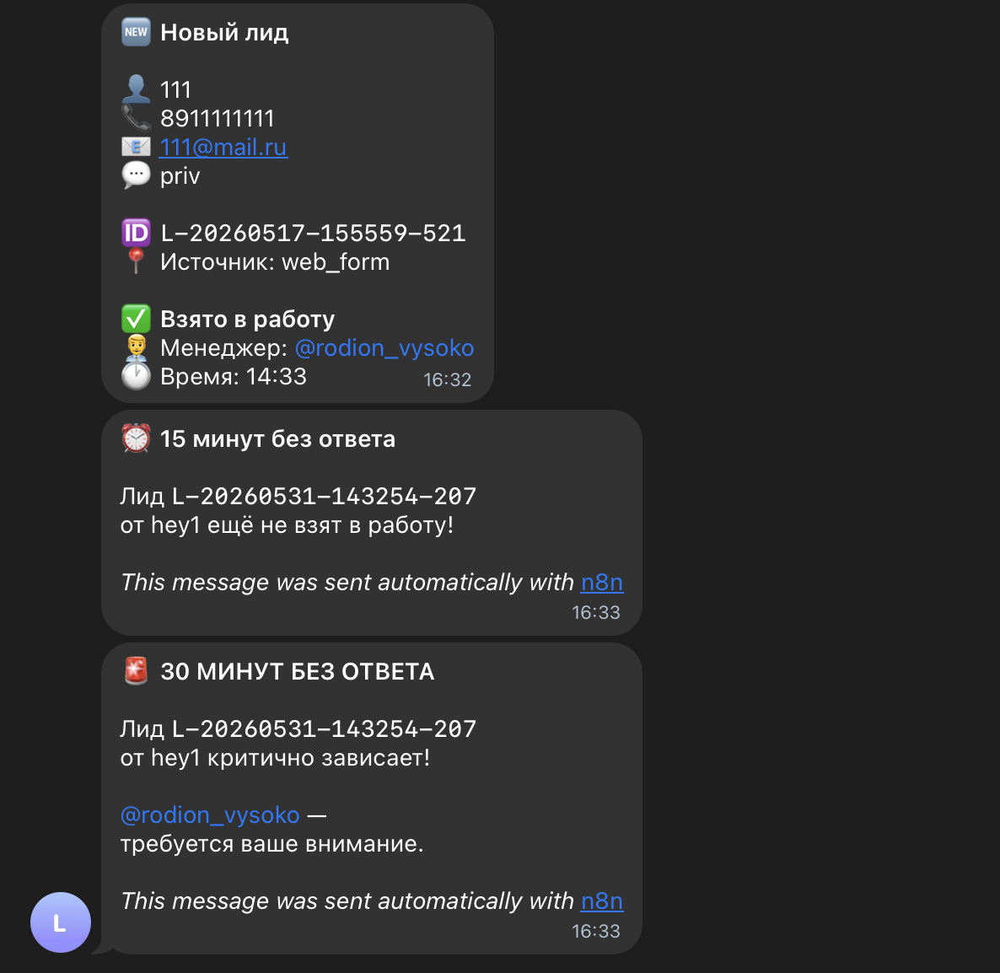
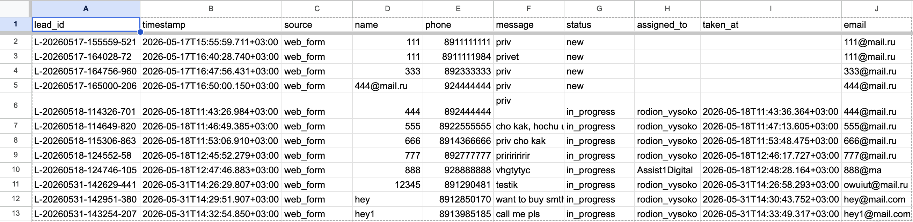

# Lead Capture & Follow-up System

> A workflow that captures web-form leads, instantly notifies the sales
> team in Telegram with a one-tap "Take Lead" button, and escalates with
> timed reminders until someone owns the lead — so no inbound inquiry goes
> unanswered.

## Problem
Inbound leads are easy to lose. A form submission lands in an inbox or a
spreadsheet, nobody notices it in time, and by the time someone follows
up the prospect has gone cold. For small sales teams without a heavy CRM,
there's no system making sure every lead gets picked up fast.

## Solution
A workflow that turns each form submission into an actionable Telegram
notification. The lead is logged to Google Sheets and posted to the team
chat with an inline "Take Lead" button. Whoever taps it is recorded as
the owner, with a timestamp. If no one claims the lead, the system
escalates: a reminder to the team after 15 minutes, then a direct,
manager-tagged alert after 30 minutes — until the lead is taken.

## Key features
- **Instant capture** — web-form submissions arrive via webhook and are
  logged immediately
- **One-tap ownership** — an inline "Take Lead" button assigns the lead to
  whoever claims it, recorded with owner and timestamp
- **Two-stage escalation** — an unclaimed lead triggers a team reminder at
  15 minutes, then a manager-tagged alert (chat + direct message) at 30
  minutes, instead of being silently forgotten
- **Shared state** — Google Sheets acts as the single source of truth, so
  lead intake and the reminder logic stay in sync
- **Deduplication** — repeat submissions don't create duplicate leads

## How it works
- A web form submits to a webhook; the lead is validated and logged to
  Google Sheets
- The team gets a Telegram message with the lead details and a "Take Lead"
  button
- When someone taps the button, the workflow records who took it and when,
  and updates the original message
- A timed check looks for leads still unclaimed: at 15 minutes it nudges
  the team, at 30 minutes it escalates with a manager-tagged alert plus a
  direct message
- Once a lead is claimed, escalation stops

## Stack
- n8n (self-hosted, Docker)
- Webhook (web-form intake)
- Telegram Bot API (notifications, inline buttons, callback handling)
- Google Sheets API (lead storage + shared state)

## Outcome
Every inbound lead is captured, visible, and owned within minutes.
Timed escalation makes sure nothing slips through, and the team gets a
lightweight lead-assignment system without paying for or configuring a
full CRM.

## Screenshots

*The full workflow: form intake, Telegram notification with inline button,
callback handling, and the two-stage reminder cascade.*

*A new lead with a one-tap "Take Lead" button, followed by the automatic
15- and 30-minute escalation reminders when a lead goes unclaimed.*

*Each lead is logged with its status, owner, and the time it was claimed.*
