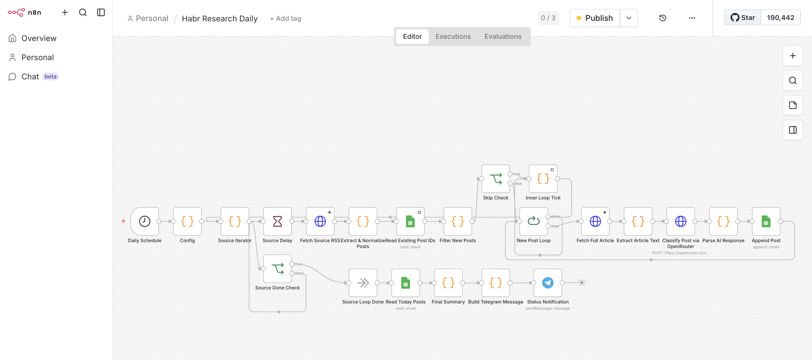
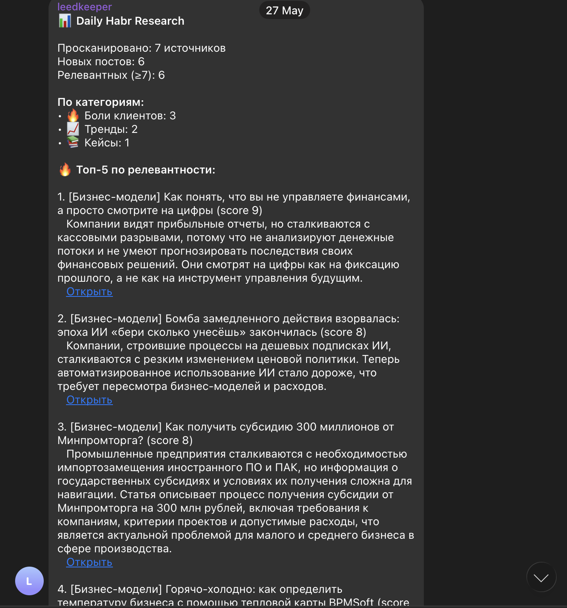
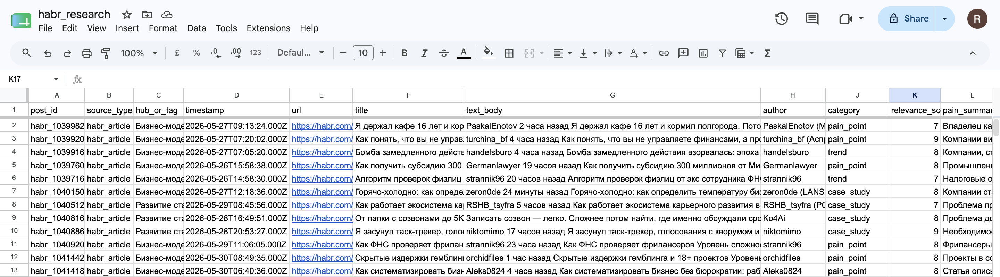

# AI Content Monitoring & Digest

> A scheduled pipeline that monitors multiple content sources, uses an LLM
> to classify and score each item for relevance, removes duplicates, and
> delivers a short daily digest to Telegram — so you stay on top of what
> matters without reading everything yourself.

## Problem
Staying current means scanning a lot of sources — news sites, blogs,
industry feeds — most of which isn't relevant on any given day. Doing it
manually is time-consuming and easy to drop. Generic RSS readers just pile
up unread items without telling you what's actually worth your attention.

## Solution
A pipeline that does the reading and filtering for you. On a schedule it
pulls in items from several content sources, sends each new one to an LLM
that classifies it and scores its relevance, removes anything already seen,
and compiles the relevant items into a single digest delivered to Telegram.
Everything processed is logged to Google Sheets for history and to avoid
re-processing.

## Key features
- **Multi-source ingestion** — pulls from several RSS feeds on a schedule
- **LLM classification** — each item is categorized and scored for
  relevance, so the digest is curated, not just a dump
- **Deduplication** — items already processed are skipped, tracked via
  Google Sheets
- **Daily digest** — relevant items are delivered as one clean Telegram
  message instead of constant noise
- **Resilient looping** — handles empty results and source-by-source
  processing without breaking the run

## How it works
- A schedule trigger starts the run (e.g. daily)
- The workflow fetches items from each configured source
- New items are checked against a Google Sheet to skip duplicates
- Each new item is sent to an LLM for classification and a relevance score
- Classified items are written back to the sheet
- At the end of the run, the relevant items are compiled into a digest and
  sent to Telegram

## Stack
- n8n (self-hosted, Docker)
- RSS feeds (content sources)
- LLM via OpenRouter (classification & relevance scoring)
- Google Sheets API (history + deduplication)
- Telegram Bot API (digest delivery)

## Outcome
Hours of manual scanning collapse into a 30-second read. Only relevant
items surface, nothing is seen twice, and the whole thing runs on its own
every day.

## Screenshots

*The full pipeline: scheduled trigger, source ingestion, deduplication,
LLM classification, and digest delivery.*

*The curated digest delivered to Telegram at the end of each run.*

*Every processed item is logged for history and deduplication.*
